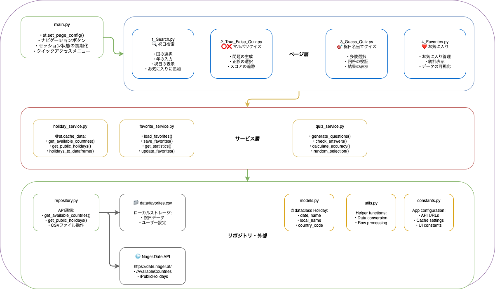

# 課題2: Stremlitを使ったアプリの開発

# アプリ説明

Nager.Date APIを使った、世界各国の祝日について楽しく学べるアプリです！！

## アプリのURL
https://2306060018miuraaiprogramming2-lnzjrtqv4tkj4vbvqnavak.streamlit.app/

## トップページ
各ページへのクイックアクセスボタンが並んでいて、ワンクリックで好きなページに飛べるようなページになっています！！

## 検索ページ
国と年を選ぶだけで、その国の祝日が一覧で表示されます！
気に入った祝日は「みんなのお気に入りに追加」ボタンでワンクリック保存可能

## ⚪︎×クイズページ
ランダムに選ばれた国と日付が表示されます！
その日が本当に祝日かどうか、⭕か❌でお答えください！

## 祝日から国当てクイズページ
「聖パトリックの日」や「感謝祭」といった祝日名が出題されます
 4択から正しい組み合わせを選んでください！！

## みんなのお気に入りページ

みんなが選んだお気に入りの祝日が一覧で見られます
人気の国ランキングや、どの月の祝日が多いかなどの統計情報も楽しめます
自分が知らなかった面白い祝日に出会えるかも？

# 開発面

## 使用したAPI

今回のアプリでは、[Nager.Date API](https://date.nager.at/)を使用しました！

APIの詳細仕様は`api-spec.md`にまとめてあります。

## システム設計図


## コード説明図



## ファイル構成
```
.
├── api-spec.md              # Nager.Date APIの仕様書
├── constants.py             # 定数定義（API URL、キャッシュ設定等）
├── data                     # CSVデータの保存用ディレクトリ（お気に入り等）
├── main.py                  # アプリのエントリーポイント
├── models.py                # データモデル定義（Holidayクラス）
├── pages                    # Streamlitのページコンポーネント
│   ├── 1_Search.py          # 祝日検索ページ
│   ├── 2_True_False_Quiz.py # ⭕❌クイズページ
│   ├── 3_Guess_Quiz.py      # 祝日名から国当てクイズページ
│   └── 4_Favorites.py       # お気に入り一覧ページ
├── README.md                # プロジェクト説明書（このファイル）
├── repository.py            # API通信とデータアクセス層
├── requirements.txt         # 依存ライブラリ一覧
├── services                 # ビジネスロジック層
│   ├── favorite_service.py  # お気に入り機能のロジック
│   ├── holiday_service.py   # 祝日データ処理のロジック
│   └── quiz_service.py      # クイズ生成・検証のロジック
├── tests                    # テストコード
│   ├── __init__.py          # テストパッケージ初期化
│   ├── conftest.py          # pytest共通設定・フィクスチャ
│   ├── README.md            # テストの実行方法説明
│   ├── test_favorite_service.py  # お気に入りサービスのテスト
│   ├── test_holiday_service.py   # 祝日サービスのテスト
│   ├── test_models.py       # モデルクラスのテスト
│   ├── test_quiz_service.py # クイズサービスのテスト
│   ├── test_repository.py   # リポジトリ層のテスト
│   └── test_utils.py        # ユーティリティ関数のテスト
├── utils.py                 # 共通ユーティリティ関数
```

## 使用したライブラリ
- streamlit - アプリ作成で使用
- pandas - csvでのデータ管理で使用
- requests - APIとの通信で使用
- pytest - テスト実行に使用
- pytest-mock - テストのモックデータ作成に使用
- pytest-cov - テストのカバレッジ確認のため使用

## 使用したLinter・Formatter

Linter: Ruff  
Formatter: Ruff